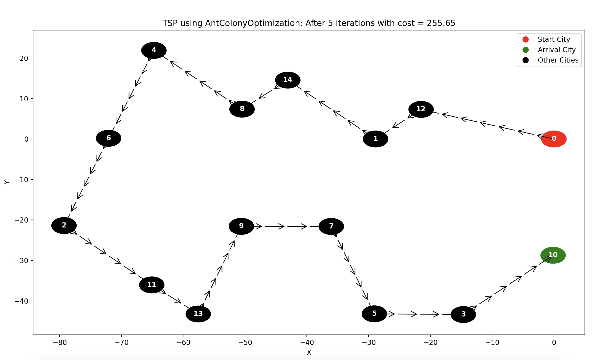

# Traveling Salesman Problem (TSP)

## Table of Content 
- [Introduction](#introduction)
- [Solver Algorithms](#solver-algorithms)
- [Results](#results)

## Introduction

The Traveling Salesman Problem (TSP) is a well-known and fundamental problem in computer science. It belongs to the class of NP-hard (nondeterministic polynomial-time hard) problems, which means that it is computationally challenging to find an optimal solution in a reasonable amount of time as the problem size grows.

## Solver Algorithms

The TSP solver provides three different algorithms:

1. **Nearest Neighbor (nn):** This algorithm starts with an initial city and repeatedly selects the nearest unvisited city until all cities are visited. It may not always find the optimal solution but is computationally efficient.

2. **Genetic Algorithm (genetics):** This algorithm uses a genetic approach to evolve a population of tours over multiple generations.

3. **Ant Colony Optimization (antcolony):** This algorithm is inspired by the foraging behavior of ants. It uses pheromone levels and distances to make decisions about the next city to visit.

To ensure reproducible results, random operations within the solver algorithms are seeded with a fixed value. You can customize this seed to obtain the same results or tweak it as needed for your experiments.

## Results

Here are the results you would expect obtained using the solver algorithms:

| Algorithm Name      | Result Image                                  |
| ------------------- | --------------------------------------------- |
| Genetic Algorithm (return)  |  |
| Ant Colony Optimization |  |
